# P0-wireframe

Este repositorio contiene esquemas para una aplicación de venta de guitarras.  
Incluye un esquema de la interfaz para movil y tambien para escritorio (web).  
 
Ambos esquemas fueron realizados usando la plataforma [excalidraw.com](https://excalidraw.com/).  

## Links directos
Para ir rapidamente a cada esquema ya sea web o móvil, puede usar los siguientes links:  
- [Esquema movil](#esquema-para-plataforma-movil)
- [Esquema web](#esquema-para-escritorio-web)

## Esquema para plataforma Movil

El esquema se encuentra en este repositorio dentro del archivo [android-schema](./mobile-schema.excalidraw) 
Y cuenta con las siguientes pantallas:

- [Landing page](#landing-page)
- [Catalogo](#catalogo-de-productos)
- [Detalles / Vista previa de producto](#detalles--vista-previa-de-producto)
- [Carrito y productos guardados](#carrito-y-productos-guardados)
- [Checkout o Pago](#checkout--pago)
- [Relacionado a cuenta](#cuenta)
- [Posts o noticias](#posts)

### Landing page

Para comenzar, la aplicacion cuenta con una landing page con información general de la tienda, principalmente influenciando
a que el usuario compre dentro de la aplicación, ofreciendo acceso al catalogo y a productos destacados al inicio de todo.

  

Luego consta de un slider que muestra los productos destacados junto con informacion y la opcionde añadir el producto al carrito,
y nuevamente dando opción a ver el catalogo de productos completo. Seguidamente, se muestra información adicional de contexto
sobre la tienda, en este caso podria ser la historia de la tienda, con imagenes historicas.

  

Además la mayoria de pantallas en las que se requiera scrollear, contienen un footer con información adicional que sirven
en diferentes contextos, informacion general, de contacto y legal.

  

### Catalogo de productos

La aplicación tambien cuenta con una pagina para listar los productos, dando la funcionalidad de filtrarlos usando un buscador
de palabras clave, filtrando tambien por precio, por tipo y por marca.  
En el listado de productos tambien se permite agregar cada producto al carrito o agregarlo a favoritos en caso
de estar interesado para luego.

  

Además provee una interfaz para poder agregar productos al catalogo a través de un formulario, Que permite
rellenar los campos necesarios y ver una vista previa sin tener que crear el producto todavia.

  

#### Detalles / Vista previa de producto
La siguiente pantalla, podria servir como ejemplo de vista previa, o como la vista definitiva de un producto encontrado
en el catálogo. Consta de la información que deberia resaltar de un producto y util para el usuario que desee comprar.

  

Y esa información no era todo, tambien muestra detalles más especificos y la capacidad de ver reseñas y valoraciones
de otros usuarios, cosa muy util y usada dentro de todas las tiendas virtuales.

  

### Carrito y productos guardados

También, existe otra pantalla donde se almacenan los productos agregados al carrito o simplemente guardados sin compromiso
de compra. Permitiendo proseguir a pagar el carrito completo o cada producto individualmente, y dando libertad al usuario de
eliminar los productos de su listado según le convenga.

  

### Checkout / Pago

Consta la aplicación de una pantalla para tramitar el pago de un pedido, requiriendo una dirección de envio, y un metodo de
pago válido electronico.

  

### Cuenta

Permite el uso de sesiones con cuentas con facil recuperación y creacion. En caso de olvidar la contraseña, permite
cambiarla facil y seguramente usando los protocolos tipicos de doble factor, en este caso, usando el correo electronico.

  

Y permitiendo también la creacion con un formulario que pide los datos escenciales para el manejo de la cuenta.

  

### Posts

Tambien existe un esquema para poder mirar posts, como noticias e información publicada por los administradores de la tienda.
Permite la lectura de los posts rapidamente sin tener que pasar por todo un post completo, sino dando la libertad de
ver el post completo en una pantalla individual (no proporcionada). Y asi poder ver solo una overview de todos los posts. 

Ademas la aplicación provee de un formulario para poder crear un post, siendo administrador claro. Permite adjuntar archivos
en cualquier lugar del post y agregar formato al texto.

  

## Esquema para escritorio (web)

Este esquema consta de 6 puntos principales: la pagina de inicio, la pagina de catalogo de productos, la pagina de detalles del producto,
la pagina de cesta de la compra y checkout, la pagina de autenticacion y registro de usuarios y la pagina de blog y noticias.
Estas son las capturas de pantalla:

- [Pagina de inicio](#pagina-de-inicio)
- [Pagina de catalogo de los productos](#pagina-de-catalogo-de-los-productos)
- [Pagina de formulario de insercion de nuevos productos](#pagina-de-formulario-de-insercion-de-nuevos-productos)
- [Pagina de detalles del producto](#pagina-de-detalles-del-producto)
- [Pagina de cesta de la compra](#pagina-de-cesta-de-la-compra)
- [Pagina de chechout](#pagina-de-checkout)
- [Pagina de login](#pagina-de-login)
- [Pagina de registro](#pagina-de-registro-de-usuarios)
- [Pagina de recuperacion de contraseña](#paginas-de-recuperacion-de-contraseña)
- [Pagina de blogs y noticias](#pagina-de-blogs-y-noticias)
- [Pagina para publicar blogs y noticias](#pagina-para-publicar-blogs-i-noticias)

### Pagina de inicio

Al ingresar veremos la pagina de inicio que nos mostrara lo que ofrece
esta tienda web, en este caso, una tienda de guitarras. En esta pagina se centra en presentar
la tienda, explicando su historia, mostrando sus productos mas destacados y en que se
se especializa este comercio.

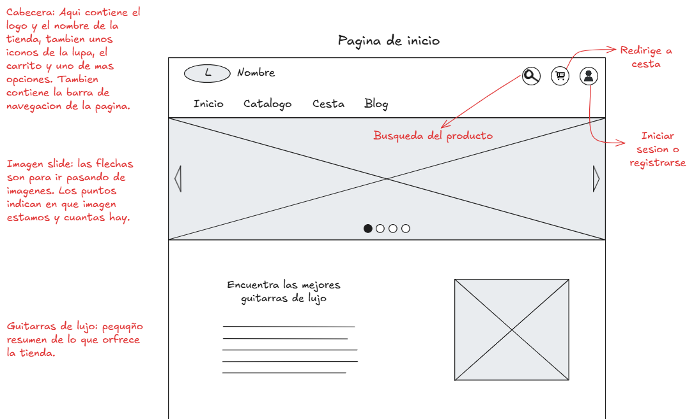  

En esta captura podemos ver la seccion que nos muestra las guitarras mas destacadas de esta tienda. Mas abajo podemos ver una seccion que se centra en explicar la historia de la tienda y su recorrido.

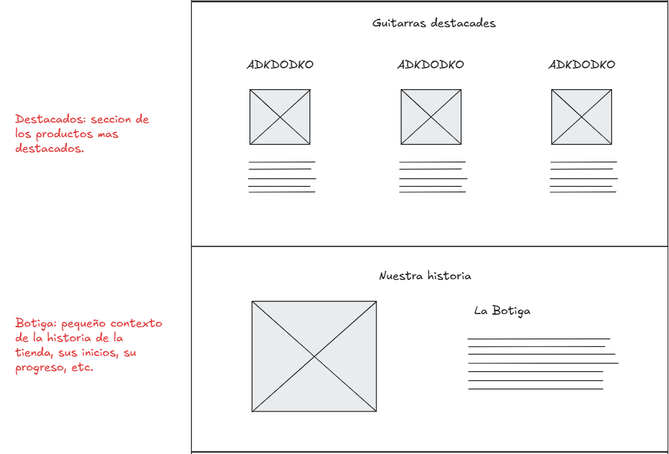  

Como ultima captura de la pagina de inicio podemos ver la seccion de mas productos, dicha seccion es centra en que el usuario lo pique para que lo redirija a ver mas productos. Luego de eso vemos abajo una imagen. Esta imagen esta para decorar la pagina. Por ultimo vemos el footer de la pagina, donde se encuentra la informacion legal, su normativa y el contacto de la tienda.

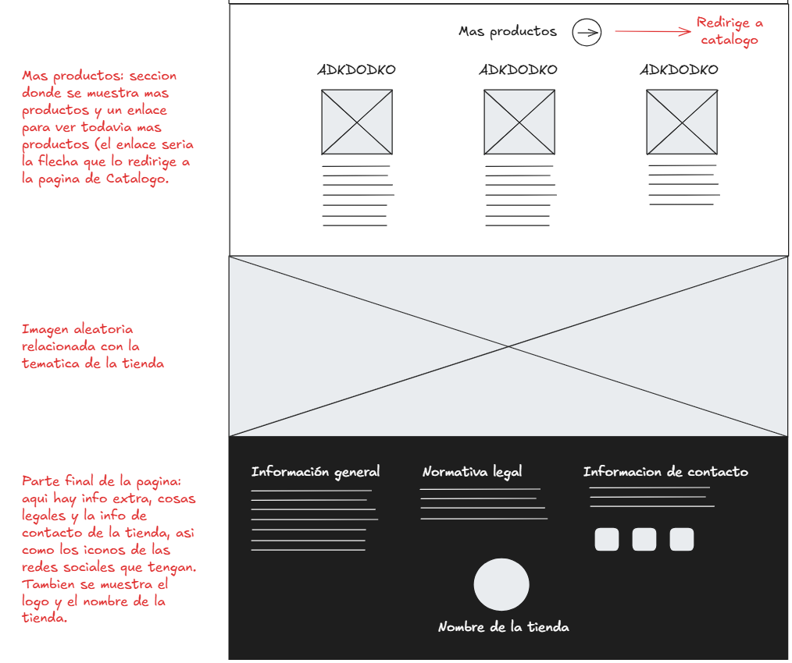  

### Pagina de catalogo de los productos

En esta pagina podemos ver una lista de productos, con un menu  para filtrar las guitarras a nuestro gusto y una barra de busqueda para buscar una guitarra en concreto. Podemos ver que al lado de cada imagen de la guitarra podemos ver el icono de añadir al carrito y el de añadir a favoritos.

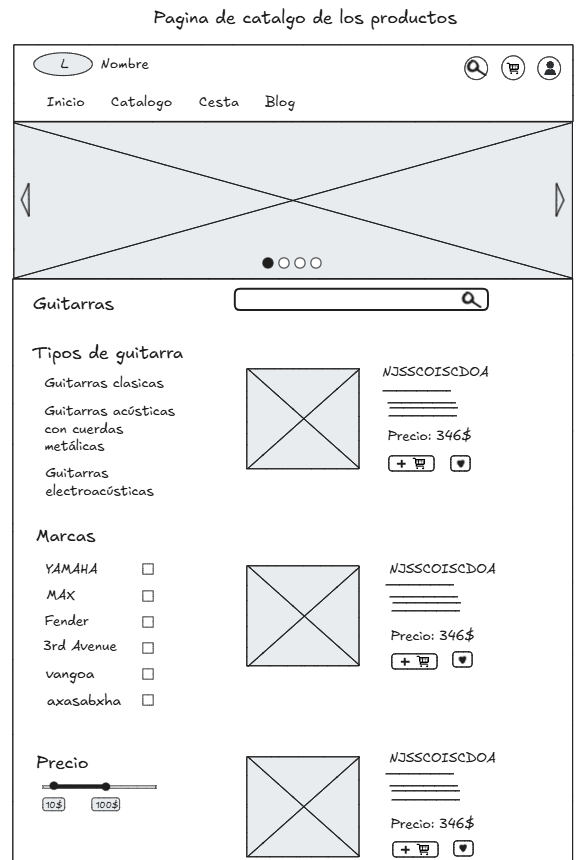  

En esta seguna imagen podemos ver como continua la pagina y podemos notar un texto donde dice "insertar un nuevo producto". Esta opcion saldra cuando el usuario sea administrador.

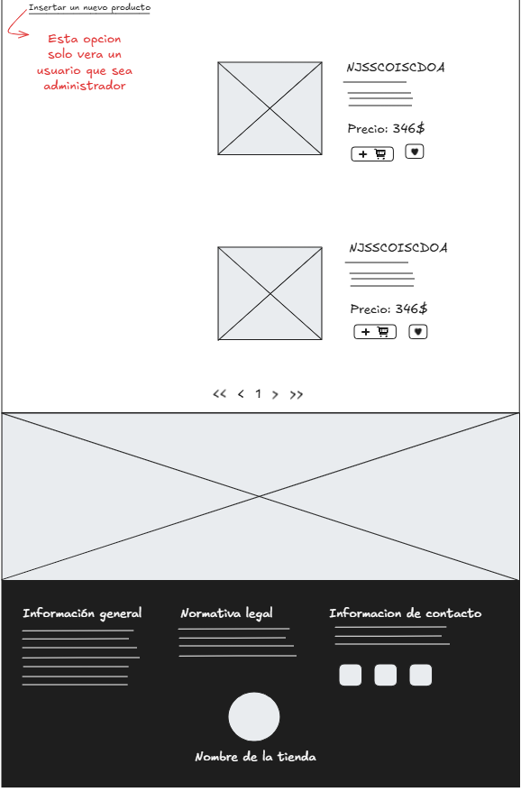  

### Pagina de formulario de insercion de nuevos productos

Si el usuario que sea administrador pica la funcion de insertar lo enviara a la siguiente pagina. En esta pagina podemos ver los diferentes campos para rellenar con tal de publicar un nuevo porducto.

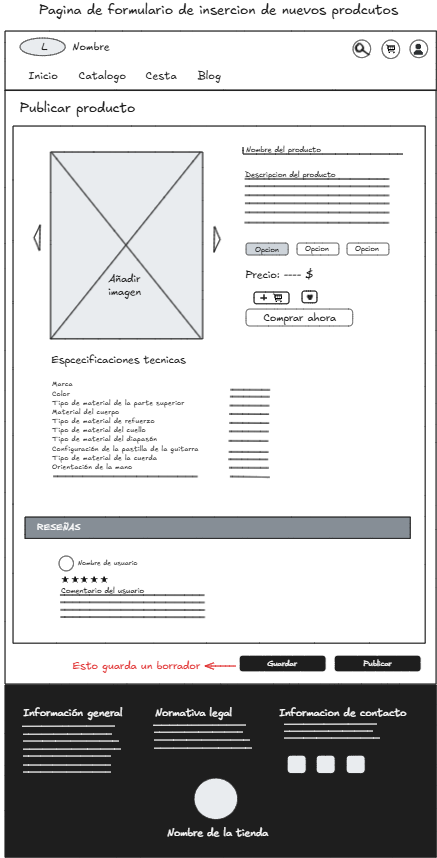  

### Pagina de detalles del producto

En esta pagina podremos ver con mas detalle las caracteristicas de una guitarra. Veremos sus diferentes imagenes que tenga, su descripcion, sus especificaciones tecnicas y mas informacion del porducto.

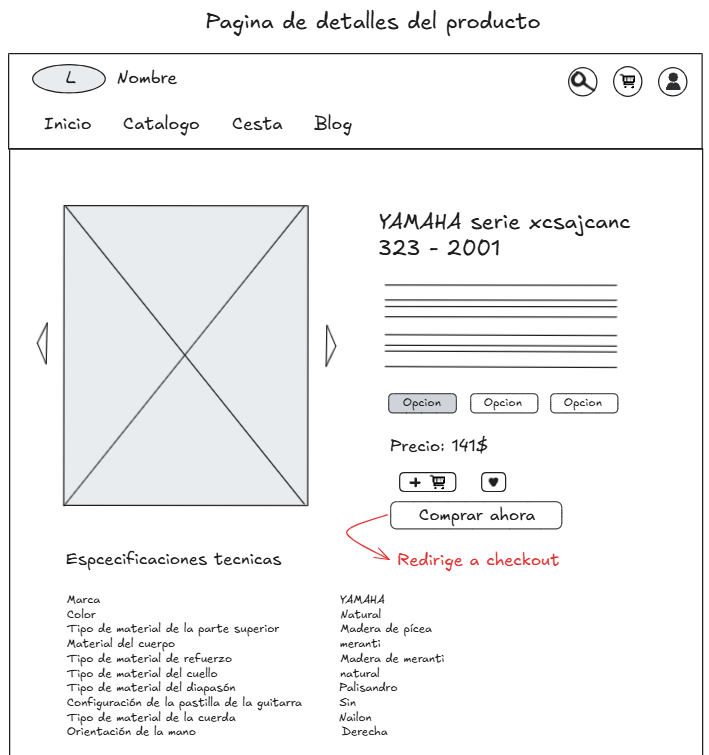  

Como a continuacion de la pagina podemos ver una seccion de reseñas, donde los usuarios pueden dejar su opinion sobre el producto y una valoracion de 1 a 5 estrellas.

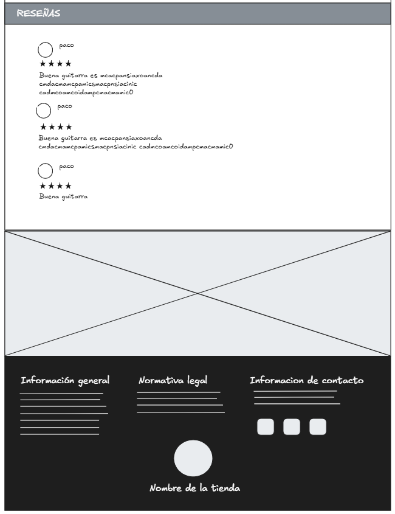  

### Pagina de cesta de la compra

En esta pagina el usuario podra ver todos los productos que ha guardado  en la cesta de la compra. El usuario si queire podra aumentar la cantidad de los productos que quiera, asi como la opcion de eliminar un producto de la cesta. 

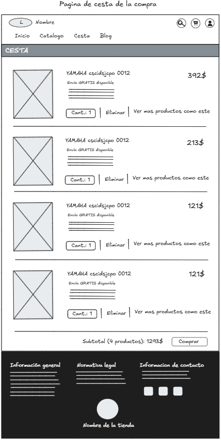  

### Pagina de checkout

Esta es la pagina que se muestra cuando picas el boton de comprar o pagar. Esta pagina sirve para tramitar el pago de un pedido, pidiendo los siguientes datos.

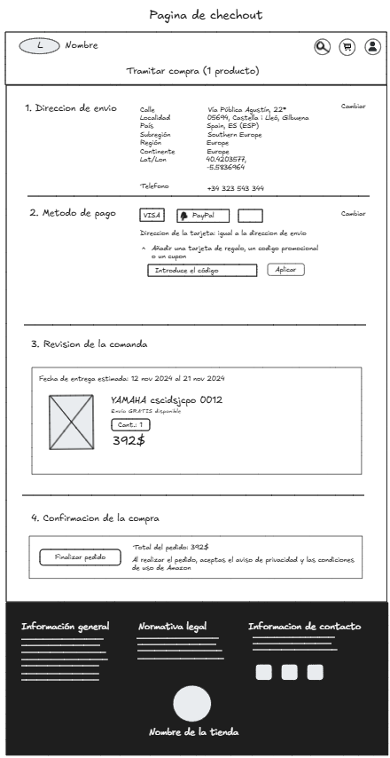  

### Pagina de login

Esta es la pagina que sale cuando picas al icono del usuario. Aqui es donde el usuario iniciara sesion.

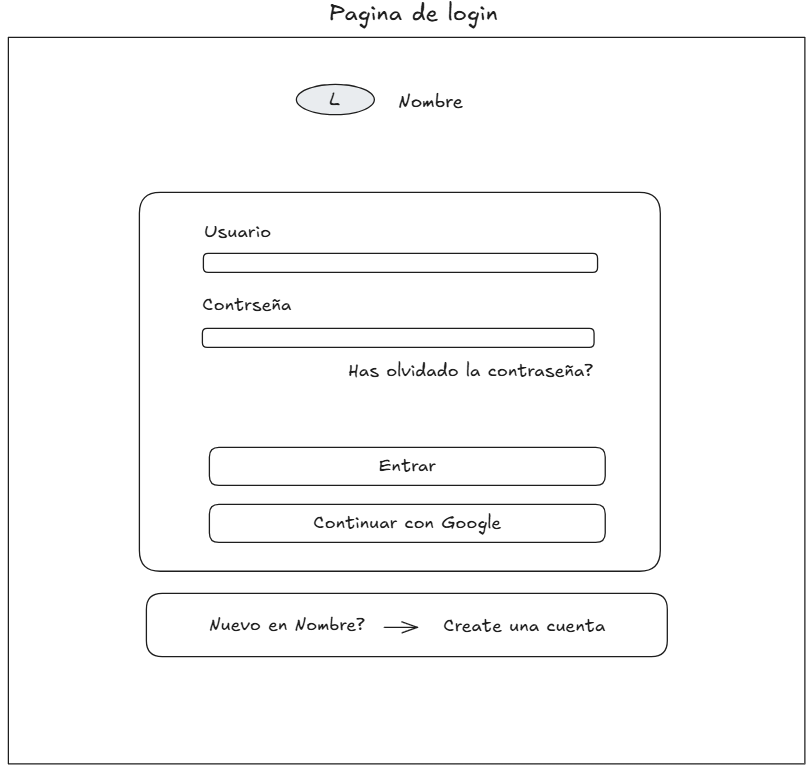  

### Pagina de registro de usuarios

Esta pagina es para aquellos usuario que no tengan una cuenta en esta web. Se les pedira rellenar los diferentes campos con tal de crearse una cuenta.

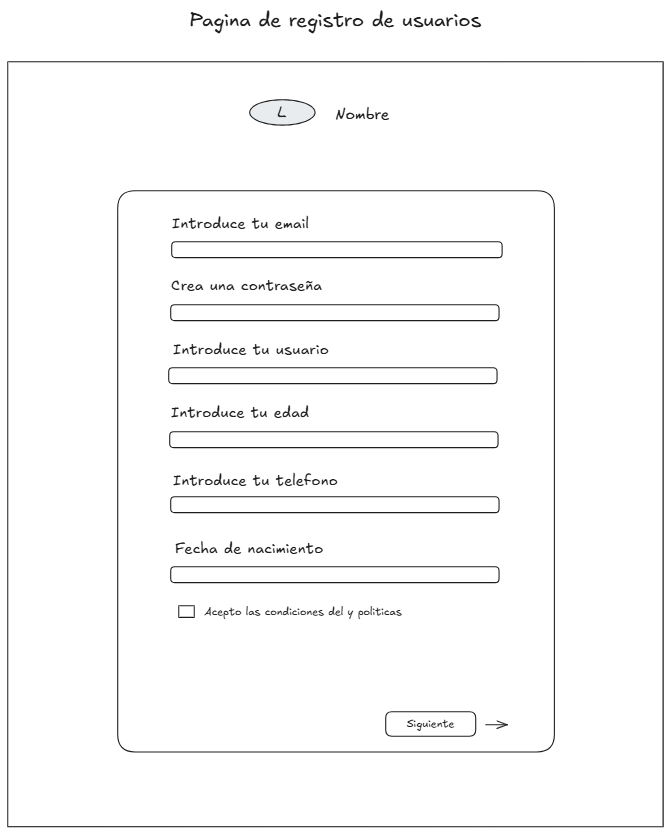  

### Paginas de recuperacion de contraseña

Estas paginas son para poder ingresar a la cuenta en caso de que el usuario se haya olvidado su contraseña. Aqui se le envia un codigo a su correo para verificar.

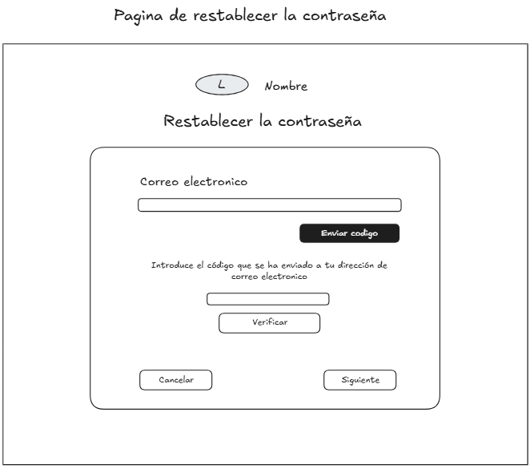  

El siguiente paso es crearse una nueva contraseña para utilizarla para ingresar en la cuenta.

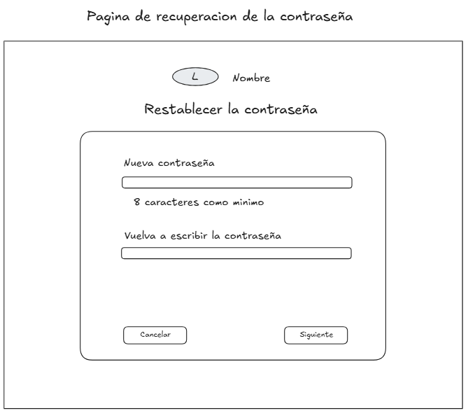  

### Pagina de blogs y noticias

En esta pagina podremos ver las diferentes publicaciones sobre el mundo relacionado con las guitarras, pudiendo visualizar blogs, articulos, noticias, posts, etc. Tambien podemos ver una opcion de publicar, que solo podra ser visible para aquel usuario que se administrador.

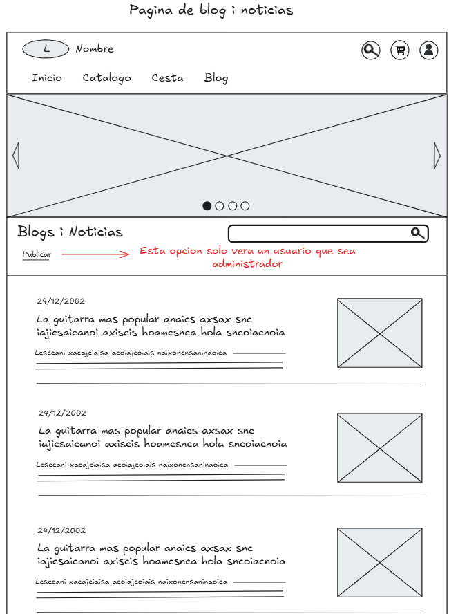  

Podemos ver como continua y como al final hay la opcion de pasar a otra pagina, asi como tambien que nos indica que nos encontramos en la pagina "1" de noticias.

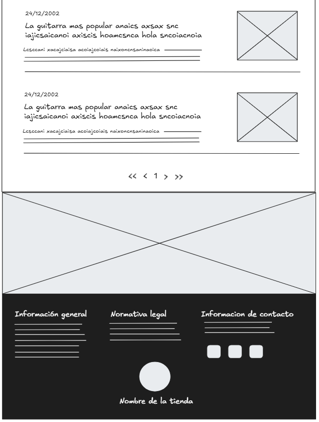  

### Pagina para publicar blogs i noticias

En esta pagina se podra publicar blogs i noticias. Esta funcion sera disponible solo para adminitradores.

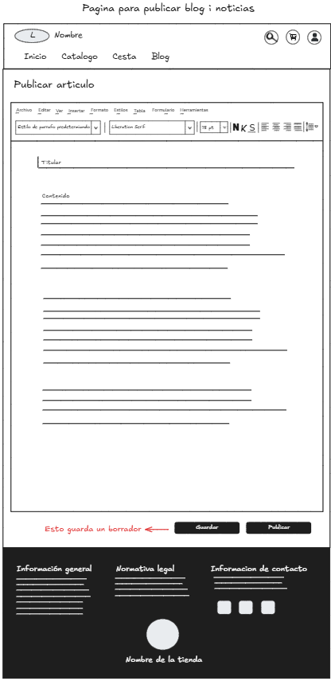  
