# P0-wireframe

Este repositorio contiene esquemas para una aplicación de venta de guitarras.  
Incluye un esquema de la interfaz para movil y tambien para escritorio (web).  
 
Ambos esquemas fueron realizados usando la plataforma [excalidraw.com](https://excalidraw.com/).  

## Esquema para plataforma Movil

El esquema se encuentra en este repositorio dentro del archivo [android-schema](./mobile-schema.excalidraw) 
Y cuenta con las siguientes pantallas:

- [Landing page](#landing-page)
- [Catalogo](#catalogo-de-productos)
- [Detalles / Vista previa de producto](#detalles--vista-previa-de-producto)
- [Carrito y productos guardados](#carrito-y-productos-guardados)
- [Checkout o Pago](#checkout--pago)
- [Relacionado a cuenta](#cuenta)
- [Posts o noticias](#posts)

### Landing page

Para comenzar, la aplicacion cuenta con una landing page con información general de la tienda, principalmente influenciando
a que el usuario compre dentro de la aplicación, ofreciendo acceso al catalogo y a productos destacados al inicio de todo.

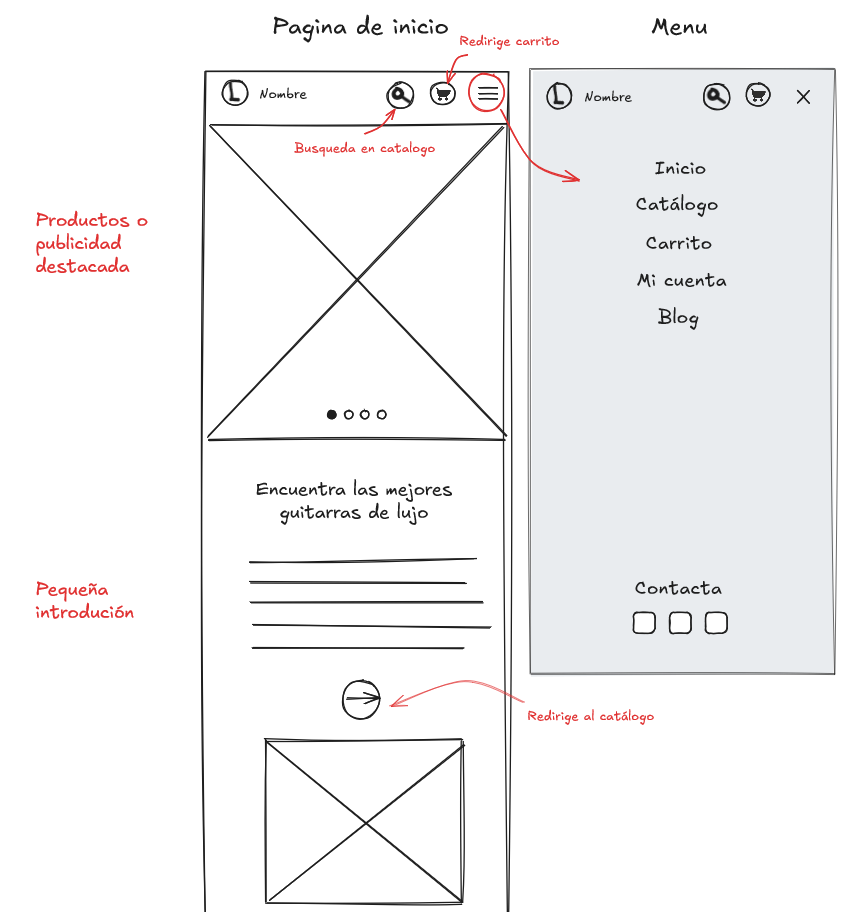  

Luego consta de un slider que muestra los productos destacados junto con informacion y la opcionde añadir el producto al carrito,
y nuevamente dando opción a ver el catalogo de productos completo. Seguidamente, se muestra información adicional de contexto
sobre la tienda, en este caso podria ser la historia de la tienda, con imagenes historicas.

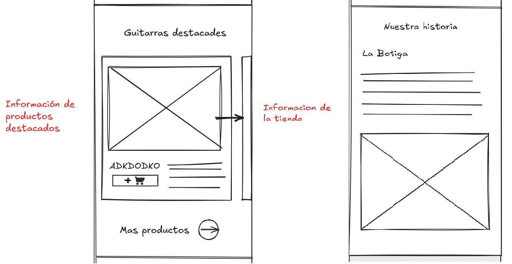  

Además la mayoria de pantallas en las que se requiera scrollear, contienen un footer con información adicional que sirven
en diferentes contextos, informacion general, de contacto y legal.

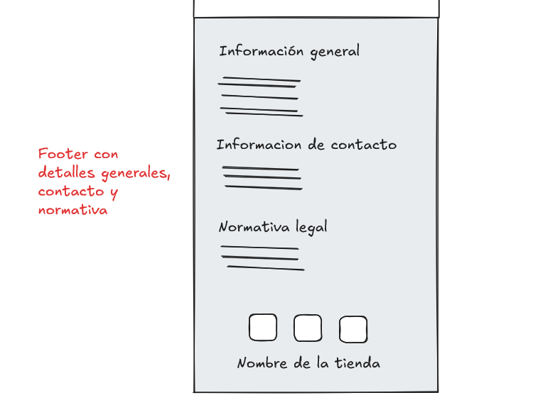  

### Catalogo de productos

La aplicación tambien cuenta con una pagina para listar los productos, dando la funcionalidad de filtrarlos usando un buscador
de palabras clave, filtrando tambien por precio, por tipo y por marca.  
En el listado de productos tambien se permite agregar cada producto al carrito o agregarlo a favoritos en caso
de estar interesado para luego.

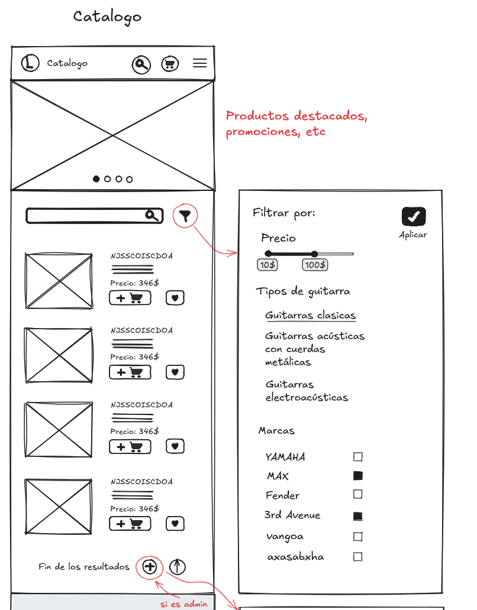  

Además provee una interfaz para poder agregar productos al catalogo a través de un formulario, Que permite
rellenar los campos necesarios y ver una vista previa sin tener que crear el producto todavia.

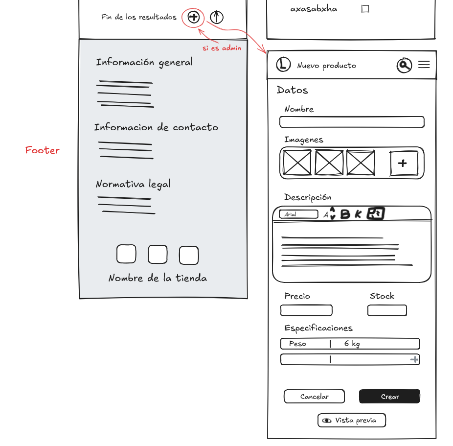  

#### Detalles / Vista previa de producto
La siguiente pantalla, podria servir como ejemplo de vista previa, o como la vista definitiva de un producto encontrado
en el catálogo. Consta de la información que deberia resaltar de un producto y util para el usuario que desee comprar.

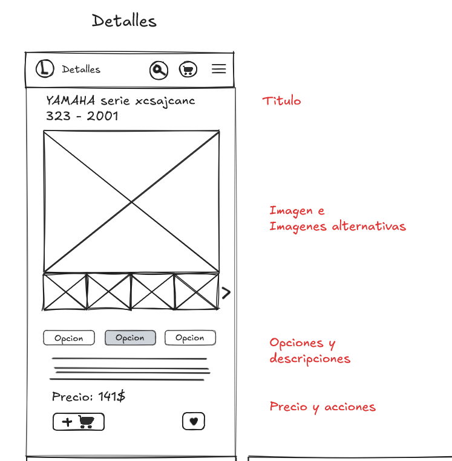  

Y esa información no era todo, tambien muestra detalles más especificos y la capacidad de ver reseñas y valoraciones
de otros usuarios, cosa muy util y usada dentro de todas las tiendas virtuales.

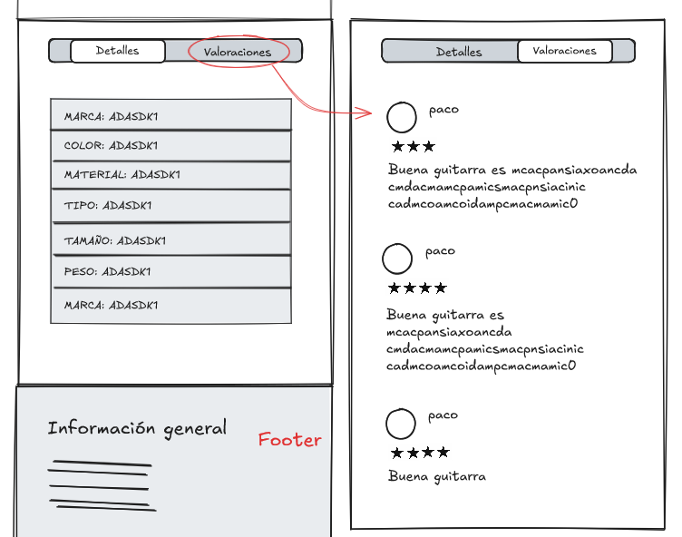  

### Carrito y productos guardados

También, existe otra pantalla donde se almacenan los productos agregados al carrito o simplemente guardados sin compromiso
de compra. Permitiendo proseguir a pagar el carrito completo o cada producto individualmente, y dando libertad al usuario de
eliminar los productos de su listado según le convenga.

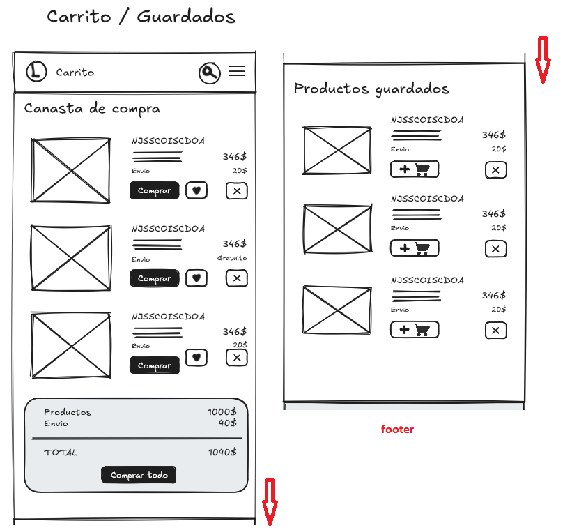  

### Checkout / Pago

Consta la aplicación de una pantalla para tramitar el pago de un pedido, requiriendo una dirección de envio, y un metodo de
pago válido electronico.

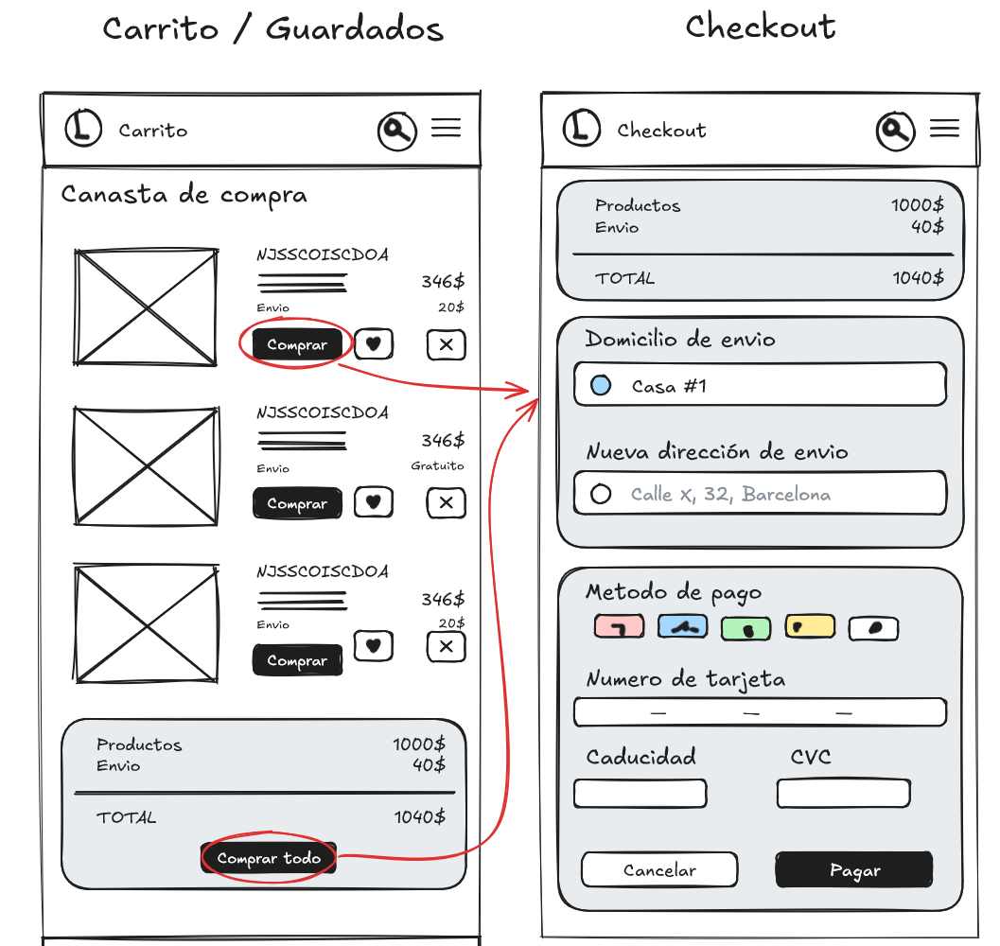  

### Cuenta

Permite el uso de sesiones con cuentas con facil recuperación y creacion. En caso de olvidar la contraseña, permite
cambiarla facil y seguramente usando los protocolos tipicos de doble factor, en este caso, usando el correo electronico.

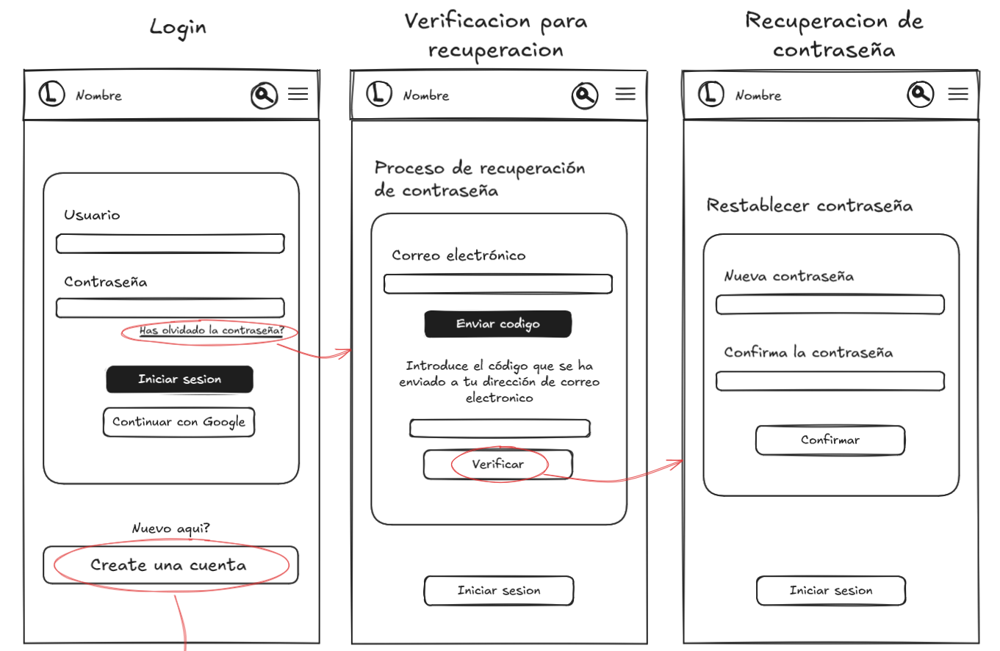  

Y permitiendo también la creacion con un formulario que pide los datos escenciales para el manejo de la cuenta.

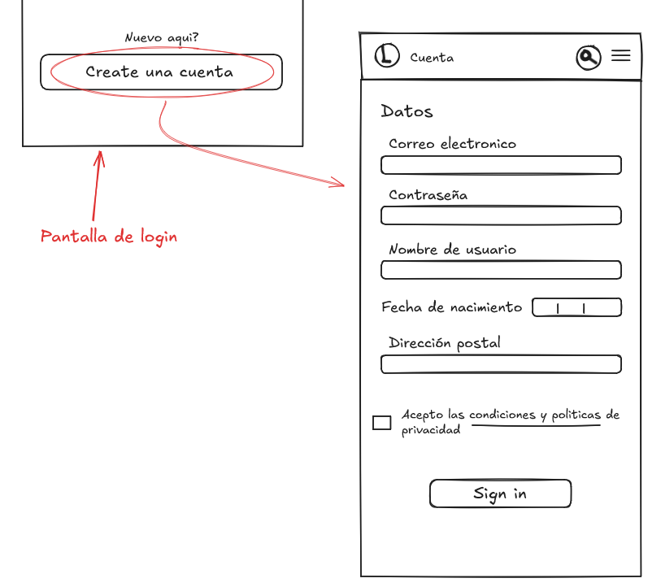  

### Posts

Tambien existe un esquema para poder mirar posts, como noticias e información publicada por los administradores de la tienda.
Permite la lectura de los posts rapidamente sin tener que pasar por todo un post completo, sino dando la libertad de
ver el post completo en una pantalla individual (no proporcionada). Y asi poder ver solo una overview de todos los posts. 

Ademas la aplicación provee de un formulario para poder crear un post, siendo administrador claro. Permite adjuntar archivos
en cualquier lugar del post y agregar formato al texto.

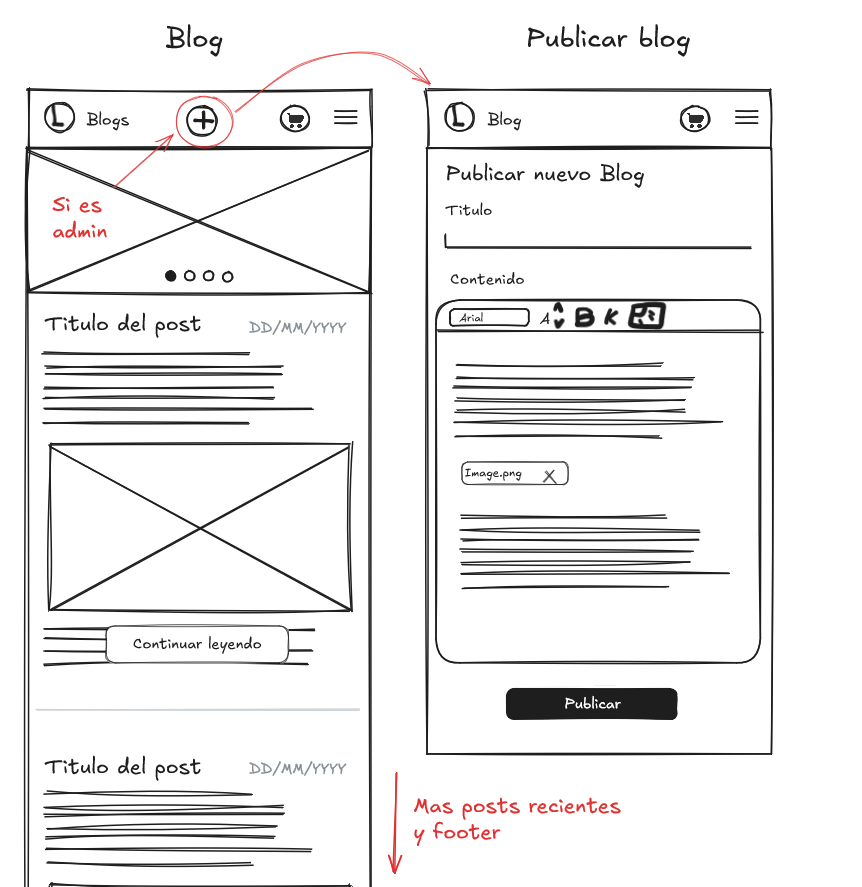  

## Esquema para escritorio (web)

Este esquema consta de 6 puntos principales: la pagina de inicio, la pagina de catalogo de productos, la pagina de detalles del producto,
la pagina de cesta de la compra i checkout, la pagina de autenticacion i registro de usuarios i la pagina de blog i noticias.
Estas son las capturas de pantalla:

- [Pagina de inicio](#pagina-de-inicio)
- [Pagina de catalogo](#pagina-de-catalogo)
- [Pagina de detalles](#)
- [Carrito y productos guardados](#carrito-y-productos-guardados)
- [Checkout o Pago](#checkout--pago)
- [Relacionado a cuenta](#cuenta)
- [Posts o noticias](#posts)

### Pagina de inicio

Al ingresar veremos la pagina de inicio que nos mostrara lo que ofrece
esta tienda web, en este caso, una tienda de guitarras. En esta pagina se centra en presentar
la tienda, explicando su historia, mostrando sus productos mas destacados y en que se
se especializa este comercio.

  

### Pagina de catalogo

### Pagina de detalles